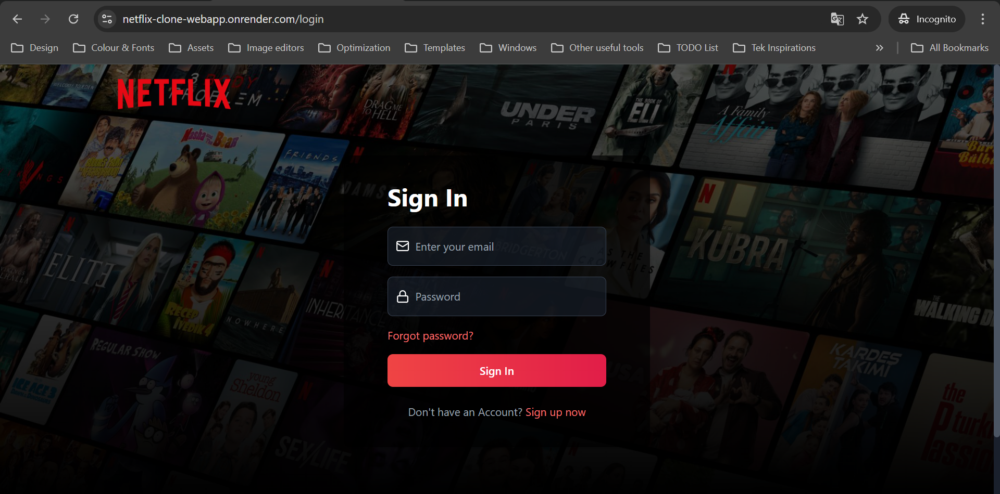

<a name="top"></a>
<h1 align="center">MERN Netflix Clone 🎬</h1>


## This is how the project looks like:

<table>
  <tr>
    <td>
      <a href='./login-screen.png'></a>
    </td>
    <td>
      <a href='./search-page.png'></a>
    </td>
    <td>
      <a href='./watch-trailers.png'></a>
    </td>
  </tr>
</table>

## About This Project:


⚛️ Tech Stack: <kbd>[React.js](https://react.dev/learn/installation)</kbd>, <kbd>[Node.js](https://nodejs.org/en/download/package-manager)</kbd>, <kbd>[Express.js](https://expressjs.com)</kbd>, <kbd>[MongoDB](https://www.mongodb.com)</kbd>, <kbd>[Tailwind CSS](https://tailwindcss.com/docs/installation)</kbd>

### 🔧 Backend 
- 🗄️ MongoDB Setup
- 🔐 Authentication with JWT
- 🔄 Forgot & Reset Password
- 📧 Sending account related emails
- 🔒 Protecting Our Routes
- 🎬 Fetch Movies and Tv Shows from TMDB API
- 🙌 Fetch Similar Movies and Tv Shows
- 🔎 Search for Actors and Movies
  
### 🌐 Frontend
- 📋 Signup Page UI
- 🔓 Login Page UI
- ✅ Email Verification Page UI
- 📤 Implementing Signup
- 🔑 Implementing Login
- 📧 Implementing Email Verification
- 🔄 Implementing Forgot Password
- 📱 Responsive UI
- 🎥 Watch Trailers
- 🔥 Fetch Search History
- 💙 Awesome Landing Page
- 🌐 Deployment
- 🚀 And Many More Cool Features

<br/>

## System requirements

> [!NOTE]
> Before you start, make sure you have the following installed:
- [x] Node.js 20.12.0 or later installed.
- [x] React.js 18.3.1 or later.
- [x] Operating systems: macOS, Windows, or Linux.
- [x] VSCode or another text editor of your choice.

<br/>

## Code organization and folder structure


```

(Root)
├───backend               
│     ├───config
│     ├───controllers
│     ├───helpers
│     ├───middlewares
│     ├───models
│     ├───routes
│     ├───services
│     │    ├───mailtrap-service.js
│     │    │   └───[[...emails]]
│     │    └───tmdb-service.js
│     │       └───[[...data]]
│     ├───(app.js)
│     ├───(package.json)
│     └───(package.lock.json)
│
├───frontend               
│     ├───public
│     │    └─[[...assets]]
│     ├───src  
│     │     ├───components
│     │     │     └───skeletons 
│     │     ├───hooks
│     │     ├───pages
│     │     │     └───home
│     │     ├───store
│     │     ├───utils
│     │     ├───(app.jsx)
│     │     ├───(main.jsx)
│     │     └───(index.css)
│     │
│     ├───(index.html)
│     ├───(eslint.config.js)
│     ├───(tailwind.config.js)
│     ├───(package.json)
│     └───(package.lock.json)
│             
├───(.prettierignore)
├───(.prettierrc.js)
├───(package.json)
└───(package.lock.json)

```

###  `public` **directory**

This folder serve static assets, like images, fonts files. 


###  `components` **directory**

this folder contains react components  which are independent and reusable.


###  `hooks`  **directory**

this folders contains all custom hooks which will be used in components


### `pages`  **directory**

You can use this directory to create object page models.
The Page Object Model (POM) is a design pattern commonly used in software testing, specifically in the context of test automation for web applications. It helps in creating an organized and maintainable structure for test scripts by encapsulating the details of the web pages and their elements.


###  `store` **directory**

This folder contains state management files for zustand library.


###  `utils` **directory**

this folder contains all the utility functions. 


### `index.css` **file**

This is the main css file of the application. You can use this file to add CSS rules to all the routes in your application - such as CSS reset rules, site-wide styles for HTML elements like links, and more.


<br/>

## 🚀 Quick Start Guide

To spin up this project locally, follow these steps

### Clone

Use the ` git clone ` CLI to clone template directly  to your machine


### Run project on local

```bash
npm run build
npm start
```

## Project Dev Steps

1. Environment Setup
   
   Create a `.env` file on the root of project
   PUT THIS INSIDE

```bash

# Node server
SERVER_PORT=8000
NODE_ENV=development

# CLient config
CLIENT_HOST=localhost
CLIENT_PORT=5173
CLIENT_URL=http://localhost:5173

# JWT secret
JWT_SECRET=your_jwt_secret

# Database integration
MONGO_URI=your_mongodb_uri

# TMDB API integration
TMDB_API_KEY=your_tmdb_api_key

# Mailtrap integration
MAILTRAP_TOKEN=your_mailtrap_token
MAILTRAP_ENDPOINT=https://sandbox.api.mailtrap.io/api/send/{your_mailbox_id}
    
```

2.  Project Folders & Files Structure

3.  Update `package.json` file from root directory

```json

// For mac and linux users
 "scripts": {
    "dev": "NODE_ENV=development&& concurrently \"cd backend && npm run dev\" \"cd frontend && npm run dev\" ",
    "start": "NODE_ENV=production&& node backend/app.js",
    "build": "npm install && npm install --prefix backend && npm install --prefix frontend && npm run build --prefix frontend",
    "format": "prettier --print-width=120 --write ."
  }

// For windows users
 "scripts": {
    "dev": "SET NODE_ENV=development&& concurrently \"cd backend && npm run dev\" \"cd frontend && npm run dev\" ",
    "start": "SET NODE_ENV=production&& node backend/app.js",
    "build": "npm install && npm install --prefix backend && npm install --prefix frontend && npm run build --prefix frontend",
    "format": "prettier --print-width=120 --write ."
  }


```
4.  Setup Eslint & Prettier
   
5.  Run project in development

```bash

npm install
npm run dev

```

> [!TIP]
> Run this command to format code before running `git commit` command.

```bash
npm run format
```

### I'll see you in the next one!

<br>

[Back to top](#top)
